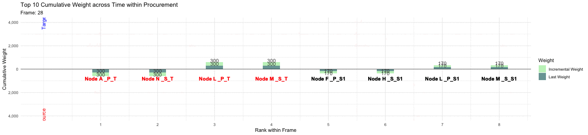
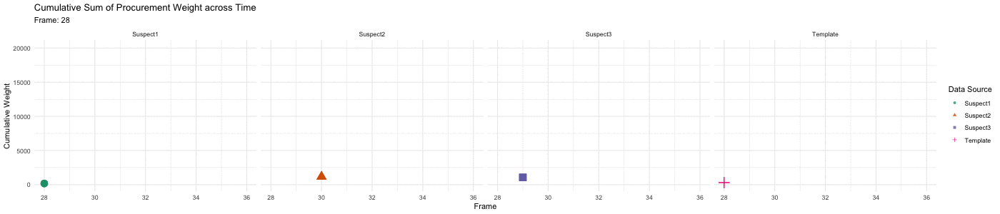

# VAST Challenge 2020
The 2020 IEEE VAST Challenge asks participants to apply visual analytics to solve three mini-challenges to help a world impacted by a worldwide cyber event.

### Overview
Our team "Night Parrot" examined a cyber think-tank - Center for Global Cyber Strategy (CGCS) - records and identified groups who most closely resemble the identified profile. 

### Version
15 July 2020

### Scope
Given curated data from several White-hat hackers as well as the Template of malicious patterns, our team compared and contrasted the Template and five Suspect networks. After narrowing down suspects with higher-level visuals, the flow of procurement transactions over time was presented using animated plots. 

### Design 
* Heatmap
* Network layouts
* tSNE
* Visuals of weight animated across time

### Interesting Findings
* Top 10 Cumulative Weight across Time within Procurement
&nbsp;&nbsp;&nbsp; 
* Cumulative Sum of Procurement Weight across Time 
&nbsp;&nbsp;

### Related Links
Challenge homepage: https://vast-challenge.github.io/2020/index.html 
Mini-Challenge 1 (Graph Analysis): https://vast-challenge.github.io/2020/MC1.html 
Team repo homepage: https://github.com/nspyrison/VAST_Challenge_2020/
